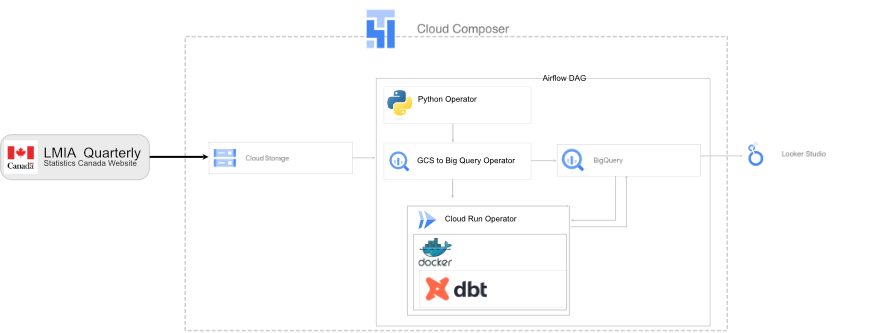
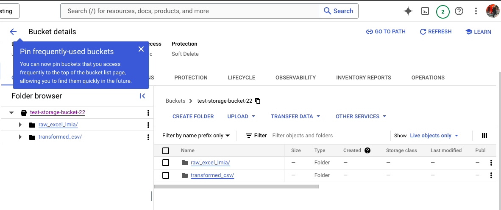

# Governmant of Canada Labour Market Intake Assessment ELT Pipeline
Pipeline using Google cloud related technologies in order to load and review intake assessments that were approved by the government of canada. These assessments are used to determine how many foreign worker can be hired and is an acknowledgement tha the employer is able to financially support these workers during their stay.
## Extraction
Files were extracted manually from the statistics canada website where they are freely available to the public.
## Tech Stack
1. GCP Cloud Composer
2. GCP Cloud Storage
## Architecture

