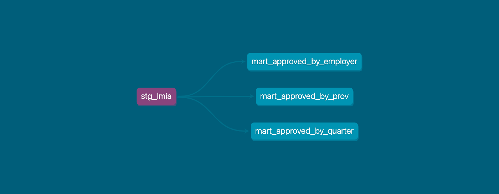

# Governmant of Canada Labour Market Intake Assessment ELT Pipeline
Pipeline using Google cloud related technologies in order to load and review intake assessments that were approved by the government of canada. These assessments are used to determine how many foreign worker can be hired and is an acknowledgement tha the employer is able to financially support these workers during their stay.

## Extraction
Files were extracted manually from the statistics canada website where they are freely available to the public.

For the sake of simplicity only the first 3 quarters of 2024 were used.

## Loading
Files were saved from the local drive, then into a Google Cloud storage bucket. It was then lightly transformed in python in order to fix some issues with the structure of the file and re-deposited to the storage bucket in a big-query ready format.

Data was then loaded via the Composer dag into bigquery through the GCS_To_BigQuery Operator which loaded the data that was mostly raw so that it can be transformed and tested in dbt.

## Transform
Data was then transformed through dbt into 1 cleaned view and the following 3 views:
1. LMIA applications by Province
2. LMIA applications by Employer
3. LMIA applications by Quarter

Once it was transformed, a full review of the columns availabe were completed and testing was added to the dbt job. Metadata was also completed and the documentation was generated.

## Visualization
Finally data was visualized using looker studio

## Tech Stack
1. GCP Cloud Composer
2. GCP Cloud Storage
3. GCP Cloud Artifactory
4. Docker
5. Data Build Tool [DBT]
6. Looker Studio

## What I've learned
1. How to use the Composer/Airflow TaskFlow workflow
2. How to build tests in dbt
3. How to create a custom DBT dockerfile and add it to artifactory
4. GCS to BigQuery Operator
5. Cloud Run

## Architecture
This is a visual representation of the finalized architecture which details how the data was loaded and transformed.

This is the DBT flow diagram that details how the transofrmation layer managed the data

Finally these are a few views that detail some summary data on the LMIA applications. As expected the two most populated provinces do in fact have the highest number of applications as well jobs offered.

## Things I would Add
1. Cloud Build [CI/CD]
2. A 3rd Looker view with periodic data
3. A new data source, Total job numbers by province by NOC Code/Employment Type
4. add a geo type into the province view in order to build a map visual in looker
