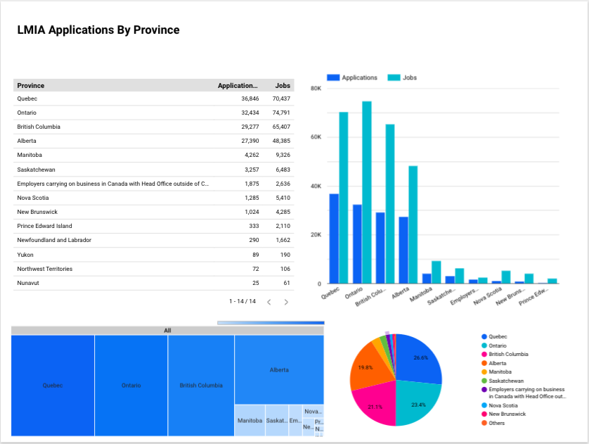

# Government of Canada Labour Market Intake Assessment(LMIA) ELT Pipeline

Pipeline using Google cloud related technologies which loads and review LMIAS. Assessments determine how many foreign worker can apply for positions at a company.

## Extraction

I extracted the data from the statistics Canada website which is available to the public.

## Loading

I transferred the files from the website to our local drive then to a  Google Cloud storage bucket. 

The DAG was setup to normalize the input data and prepare it for Big Query. Data was then loaded via the GcsToBigQueryOperator.

## Transform

Data was then transformed through dbt into 1 cleaned view and the following 3 views:

1. LMIA applications by Province

2. LMIA applications by Employer

3. LMIA applications by Quarter

Once transformed  I did a review of the columns and:

built in some tests

 added in the metadata

generated the reference graphs

## Visualization

Finally I visualized the data in looker

## Analysis
Finally these are a few views that detail some summary data on the LMIA applications. LMIA's are roughly correlated to the amount of population in each of the provinces. Ontario and Quebec being the most populated, have the most applications and jobs.

## Tech Stack

1. GCP Cloud Composer

2. GCP Cloud Storage

3. GCP Cloud Artifactory

4. Docker

5. Data Build Tool [DBT]

6. Looker Studio

## What I've learned

1. How to use the Composer/Airflow TaskFlow workflow

2. How to build tests in dbt

3. How to create a custom DBT dockerfile and add it to artifactory

4. GCS to BigQuery Operator

5. Cloud Run

## Architecture

This is the DBT flow diagram that details how the transofrmation layer managed the data

## Things I would Add

1. Cloud Build [CI/CD]

2. A 3rd Looker view with periodic data

3. A new data source, Total job numbers by province by NOC Code/Employment Type

4. add a geo type into the province view and build a map visual in looker

5. Use the DBT Seed instead of the current ingestion method